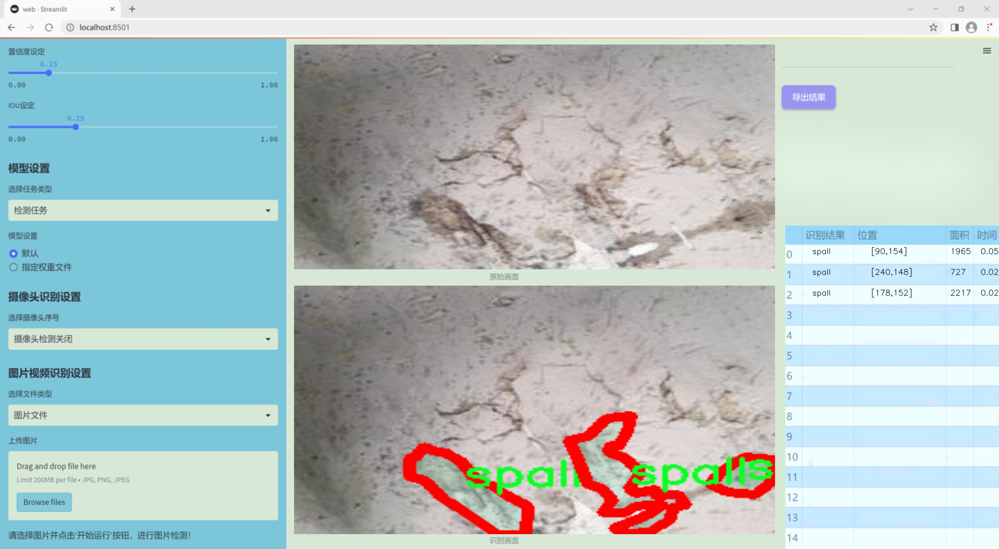
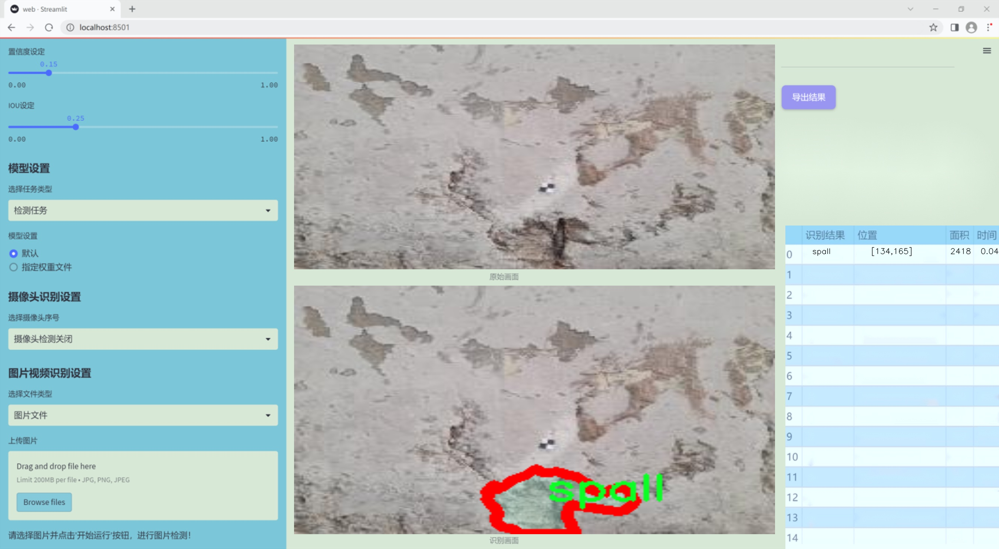
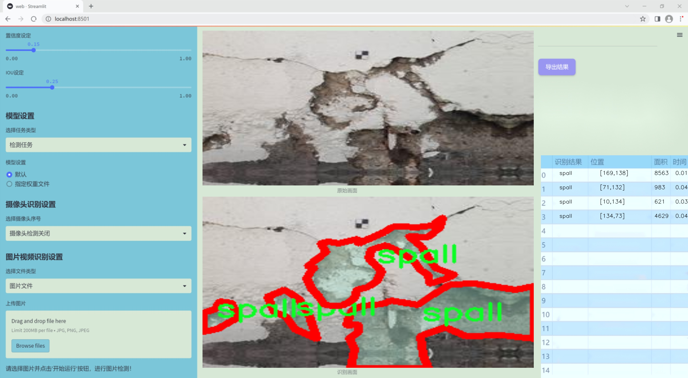
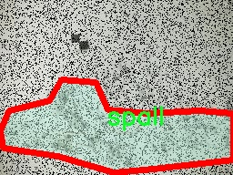
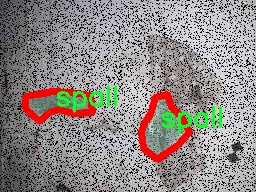
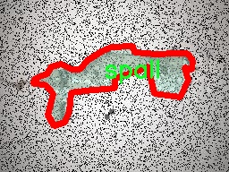
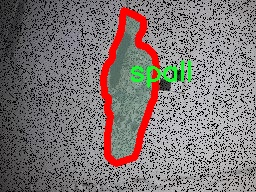
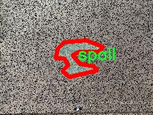

### 1.背景意义

研究背景与意义

混凝土作为现代建筑和基础设施中最常用的材料之一，其耐久性和结构安全性直接影响到工程的整体质量和使用寿命。然而，混凝土在长期使用过程中，常常会出现剥落、裂缝等病害现象，尤其是在恶劣环境条件下，剥落现象更为严重。这不仅影响了建筑物的美观，还可能导致安全隐患。因此，及时、准确地检测混凝土剥落是保障建筑安全的重要环节。

传统的混凝土剥落检测方法主要依赖人工检查，既费时又容易受到主观因素的影响，检测结果的准确性和一致性难以保证。随着计算机视觉技术的迅猛发展，基于深度学习的自动化检测方法逐渐成为研究热点。YOLO（You Only Look Once）系列模型因其高效的实时检测能力，已被广泛应用于各类目标检测任务中。然而，现有的YOLO模型在处理特定领域（如混凝土剥落检测）时，仍存在一些不足之处，例如对小目标的检测精度不足、对复杂背景的适应性差等。

本研究旨在基于改进的YOLOv11模型，构建一个高效的混凝土剥落检测系统。通过对1200张包含剥落（spall）类别的图像进行训练，利用实例分割技术，提升模型对混凝土剥落的检测精度和鲁棒性。该系统不仅能够自动识别和定位混凝土剥落区域，还能为后续的维护和修复提供数据支持，从而有效降低人工检测的成本，提高检测效率。通过这一研究，期望能够为混凝土结构的健康监测提供新的解决方案，推动建筑行业向智能化、自动化方向发展。

### 2.视频效果

[2.1 视频效果](https://www.bilibili.com/video/BV1MJkQYgExX/)

### 3.图片效果







##### [项目涉及的源码数据来源链接](https://kdocs.cn/l/cszuIiCKVNis)**

注意：本项目提供训练的数据集和训练教程,由于版本持续更新,暂不提供权重文件（best.pt）,请按照6.训练教程进行训练后实现上图演示的效果。

### 4.数据集信息

##### 4.1 本项目数据集类别数＆类别名

nc: 1
names: ['spall']


该项目为【图像分割】数据集，请在【训练教程和Web端加载模型教程（第三步）】这一步的时候按照【图像分割】部分的教程来训练

##### 4.2 本项目数据集信息介绍

本项目数据集信息介绍

本项目所使用的数据集专注于混凝土剥落检测，旨在通过改进YOLOv11模型来提升混凝土结构的监测和维护效率。数据集的主题围绕“混凝土剥落（spall）”展开，专门针对这一特定的结构损伤类型进行标注和分类。数据集中包含的类别数量为1，具体类别为“spall”，这意味着所有的图像数据均聚焦于混凝土表面剥落现象的识别与检测。

在数据集的构建过程中，我们精心挑选了来自不同环境和条件下的混凝土剥落实例，确保数据的多样性和代表性。这些图像涵盖了不同程度的剥落现象，从轻微的表面裂纹到严重的剥落区域，旨在为模型提供丰富的训练样本。数据集中的图像来源于实际的建筑工地、桥梁、隧道等多种混凝土结构，确保了数据的真实性和实用性。

为了提高模型的检测精度，我们在数据集中进行了详细的标注工作，确保每个剥落区域都被准确地框定。这一过程不仅提升了数据集的质量，也为后续的模型训练奠定了坚实的基础。此外，数据集还包含了多种光照条件和不同角度的拍摄，旨在模拟真实环境中的各种挑战，以增强模型的鲁棒性。

通过对该数据集的训练，我们期望能够显著提升YOLOv11在混凝土剥落检测任务中的表现，从而为建筑物的安全监测提供更为高效和可靠的技术支持。该数据集的构建与应用，将为混凝土结构的健康监测提供重要的理论依据和实践指导。











### 5.全套项目环境部署视频教程（零基础手把手教学）

[5.1 所需软件PyCharm和Anaconda安装教程（第一步）](https://www.bilibili.com/video/BV1BoC1YCEKi/?spm_id_from=333.999.0.0&vd_source=bc9aec86d164b67a7004b996143742dc)


[5.2 安装Python虚拟环境创建和依赖库安装视频教程（第二步）](https://www.bilibili.com/video/BV1ZoC1YCEBw?spm_id_from=333.788.videopod.sections&vd_source=bc9aec86d164b67a7004b996143742dc)

### 6.改进YOLOv11训练教程和Web_UI前端加载模型教程（零基础手把手教学）

[6.1 改进YOLOv11训练教程和Web_UI前端加载模型教程（第三步）](https://www.bilibili.com/video/BV1BoC1YCEhR?spm_id_from=333.788.videopod.sections&vd_source=bc9aec86d164b67a7004b996143742dc)


按照上面的训练视频教程链接加载项目提供的数据集，运行train.py即可开始训练



     Epoch   gpu_mem       box       obj       cls    labels  img_size
     1/200     20.8G   0.01576   0.01955  0.007536        22      1280: 100%|██████████| 849/849 [14:42<00:00,  1.04s/it]
               Class     Images     Labels          P          R     mAP@.5 mAP@.5:.95: 100%|██████████| 213/213 [01:14<00:00,  2.87it/s]
                 all       3395      17314      0.994      0.957      0.0957      0.0843

     Epoch   gpu_mem       box       obj       cls    labels  img_size
     2/200     20.8G   0.01578   0.01923  0.007006        22      1280: 100%|██████████| 849/849 [14:44<00:00,  1.04s/it]
               Class     Images     Labels          P          R     mAP@.5 mAP@.5:.95: 100%|██████████| 213/213 [01:12<00:00,  2.95it/s]
                 all       3395      17314      0.996      0.956      0.0957      0.0845

     Epoch   gpu_mem       box       obj       cls    labels  img_size
     3/200     20.8G   0.01561    0.0191  0.006895        27      1280: 100%|██████████| 849/849 [10:56<00:00,  1.29it/s]
               Class     Images     Labels          P          R     mAP@.5 mAP@.5:.95: 100%|███████   | 187/213 [00:52<00:00,  4.04it/s]
                 all       3395      17314      0.996      0.957      0.0957      0.0845


###### [项目数据集下载链接](https://kdocs.cn/l/cszuIiCKVNis)

### 7.原始YOLOv11算法讲解


##### YOLO11介绍

Ultralytics YOLO11是一款尖端的、最先进的模型，它在之前YOLO版本成功的基础上进行了构建，并引入了新功能和改进，以进一步提升性能和灵活性。
**YOLO11设计快速、准确且易于使用，使其成为各种物体检测和跟踪、实例分割、图像分类以及姿态估计任务的绝佳选择。**


**结构图如下：**


##### **C3k2**

**C3k2，结构图如下**


**C3k2，继承自类`C2f，其中通过c3k设置False或者Ture来决定选择使用C3k还是`**Bottleneck


**实现代码** **ultralytics/nn/modules/block.py**

##### C2PSA介绍

**借鉴V10 PSA结构，实现了C2PSA和C2fPSA，最终选择了基于C2的C2PSA（可能涨点更好？）**


**实现代码** **ultralytics/nn/modules/block.py**

##### Detect介绍

**分类检测头引入了DWConv（更加轻量级，为后续二次创新提供了改进点），结构图如下（和V8的区别）：**


### 8.200+种全套改进YOLOV11创新点原理讲解

#### 8.1 200+种全套改进YOLOV11创新点原理讲解大全

由于篇幅限制，每个创新点的具体原理讲解就不全部展开，具体见下列网址中的改进模块对应项目的技术原理博客网址【Blog】（创新点均为模块化搭建，原理适配YOLOv5~YOLOv11等各种版本）

[改进模块技术原理博客【Blog】网址链接](https://gitee.com/qunmasj/good)


#### 8.2 精选部分改进YOLOV11创新点原理讲解

###### 这里节选部分改进创新点展开原理讲解(完整的改进原理见上图和[改进模块技术原理博客链接](https://gitee.com/qunmasj/good)【如果此小节的图加载失败可以通过CSDN或者Github搜索该博客的标题访问原始博客，原始博客图片显示正常】

### RT-DETR骨干网络HGNetv2简介
#### RT-DETR横空出世
前几天被百度的RT-DETR刷屏，参考该博客提出的目标检测新范式对原始DETR的网络结构进行了调整和优化，以提高计算速度和减小模型大小。这包括使用更轻量级的基础网络和调整Transformer结构。并且，摒弃了nms处理的detr结构与传统的物体检测方法相比，不仅训练是端到端的，检测也能端到端，这意味着整个网络在训练过程中一起进行优化，推理过程不需要昂贵的后处理代价，这有助于提高模型的泛化能力和性能。


当然，人们对RT-DETR之所以产生浓厚的兴趣，我觉得大概率还是对YOLO系列审美疲劳了，就算是出到了YOLO10086，我还是只想用YOLOv11和YOLOv11的框架来魔改做业务。。

#### 初识HGNet
看到RT-DETR的性能指标，发现指标最好的两个模型backbone都是用的HGNetv2，毫无疑问，和当时的picodet一样，骨干都是使用百度自家的网络。初识HGNet的时候，当时是参加了第四届百度网盘图像处理大赛，文档图像方向识别专题赛道，简单来说，就是使用分类网络对一些文档截图或者图片进行方向角度分类。


当时的方案并没有那么快定型，通常是打榜过程发现哪个网络性能好就使用哪个网络做魔改，而且木有显卡，只能蹭Ai Studio的平台，不过v100一天8小时的实验时间有点短，这也注定了大模型用不了。 

流水的模型，铁打的炼丹人，最后发现HGNet-tiny各方面指标都很符合我们的预期，后面就一直围绕它魔改。当然，比赛打榜是目的，学习才是享受过程，当时看到效果还可以，便开始折腾起了HGNet的网络架构，我们可以看到，PP-HGNet 针对 GPU 设备，对目前 GPU 友好的网络做了分析和归纳，尽可能多的使用 3x3 标准卷积（计算密度最高），PP-HGNet是由多个HG-Block组成，细节如下：


ConvBNAct是啥？简单聊一聊，就是Conv+BN+Act，CV Man应该最熟悉不过了：
```python
class ConvBNAct(TheseusLayer):
    def __init__(self,
                 in_channels,
                 out_channels,
                 kernel_size,
                 stride,
                 groups=1,
                 use_act=True):
        super().__init__()
        self.use_act = use_act
        self.conv = Conv2D(
            in_channels,
            out_channels,
            kernel_size,
            stride,
            padding=(kernel_size - 1) // 2,
            groups=groups,
            bias_attr=False)
        self.bn = BatchNorm2D(
            out_channels,
            weight_attr=ParamAttr(regularizer=L2Decay(0.0)),
            bias_attr=ParamAttr(regularizer=L2Decay(0.0)))
        if self.use_act:
            self.act = ReLU()
 
    def forward(self, x):
        x = self.conv(x)
        x = self.bn(x)
        if self.use_act:
            x = self.act(x)
        return x 
```
且标准卷积的数量随层数深度增加而增多，从而得到一个有利于 GPU 推理的骨干网络，同样速度下，精度也超越其他 CNN ，性价比也优于ViT-base模型。


另外，我们可以看到：

PP-HGNet 的第一层由channel为96的Stem模块构成，目的是为了减少参数量和计算量。PP-HGNet

Tiny的整体结构由四个HG Stage构成，而每个HG Stage主要由包含大量标准卷积的HG Block构成。

PP-HGNet的第三到第五层使用了使用了可学习的下采样层（LDS Layer），该层group为输入通道数，可达到降参降计算量的作用，且Tiny模型仅包含三个LDS Layer，并不会对GPU的利用率造成较大影响.

PP-HGNet的激活函数为Relu，常数级操作可保证该模型在硬件上的推理速度。

### 9.系统功能展示

图9.1.系统支持检测结果表格显示

  图9.2.系统支持置信度和IOU阈值手动调节

  图9.3.系统支持自定义加载权重文件best.pt(需要你通过步骤5中训练获得)

  图9.4.系统支持摄像头实时识别

  图9.5.系统支持图片识别

  图9.6.系统支持视频识别

  图9.7.系统支持识别结果文件自动保存

  图9.8.系统支持Excel导出检测结果数据


### 10. YOLOv11核心改进源码讲解

#### 10.1 SwinTransformer.py

以下是对Swin Transformer的核心代码进行了提炼和详细注释的版本：

```python
import torch
import torch.nn as nn
import torch.nn.functional as F
import numpy as np
from timm.models.layers import DropPath, to_2tuple, trunc_normal_

class Mlp(nn.Module):
    """ 多层感知机 (MLP) 模块。 """

    def __init__(self, in_features, hidden_features=None, out_features=None, act_layer=nn.GELU, drop=0.):
        super().__init__()
        out_features = out_features or in_features  # 输出特征数默认为输入特征数
        hidden_features = hidden_features or in_features  # 隐藏层特征数默认为输入特征数
        self.fc1 = nn.Linear(in_features, hidden_features)  # 第一层线性变换
        self.act = act_layer()  # 激活函数
        self.fc2 = nn.Linear(hidden_features, out_features)  # 第二层线性变换
        self.drop = nn.Dropout(drop)  # Dropout层

    def forward(self, x):
        """ 前向传播 """
        x = self.fc1(x)  # 线性变换
        x = self.act(x)  # 激活
        x = self.drop(x)  # Dropout
        x = self.fc2(x)  # 线性变换
        x = self.drop(x)  # Dropout
        return x


class WindowAttention(nn.Module):
    """ 窗口基础的多头自注意力模块 (W-MSA)。 """

    def __init__(self, dim, window_size, num_heads, qkv_bias=True, attn_drop=0., proj_drop=0.):
        super().__init__()
        self.dim = dim
        self.window_size = window_size  # 窗口大小
        self.num_heads = num_heads  # 注意力头数
        head_dim = dim // num_heads  # 每个头的维度
        self.scale = head_dim ** -0.5  # 缩放因子

        # 定义相对位置偏置参数
        self.relative_position_bias_table = nn.Parameter(
            torch.zeros((2 * window_size[0] - 1) * (2 * window_size[1] - 1), num_heads))

        # 计算相对位置索引
        coords_h = torch.arange(self.window_size[0])
        coords_w = torch.arange(self.window_size[1])
        coords = torch.stack(torch.meshgrid([coords_h, coords_w]))  # 生成坐标网格
        coords_flatten = torch.flatten(coords, 1)  # 展平坐标
        relative_coords = coords_flatten[:, :, None] - coords_flatten[:, None, :]  # 计算相对坐标
        relative_coords = relative_coords.permute(1, 2, 0).contiguous()  # 调整维度
        relative_coords[:, :, 0] += self.window_size[0] - 1  # 坐标偏移
        relative_coords[:, :, 1] += self.window_size[1] - 1
        relative_coords[:, :, 0] *= 2 * self.window_size[1] - 1
        self.register_buffer("relative_position_index", relative_coords.sum(-1))  # 注册相对位置索引

        self.qkv = nn.Linear(dim, dim * 3, bias=qkv_bias)  # 线性变换生成Q, K, V
        self.attn_drop = nn.Dropout(attn_drop)  # 注意力的Dropout
        self.proj = nn.Linear(dim, dim)  # 输出线性变换
        self.proj_drop = nn.Dropout(proj_drop)  # 输出的Dropout
        trunc_normal_(self.relative_position_bias_table, std=.02)  # 初始化相对位置偏置
        self.softmax = nn.Softmax(dim=-1)  # Softmax层

    def forward(self, x, mask=None):
        """ 前向传播 """
        B_, N, C = x.shape  # B: 批量大小, N: 序列长度, C: 特征维度
        qkv = self.qkv(x).reshape(B_, N, 3, self.num_heads, C // self.num_heads).permute(2, 0, 3, 1, 4)
        q, k, v = qkv[0], qkv[1], qkv[2]  # 分离Q, K, V

        q = q * self.scale  # 缩放Q
        attn = (q @ k.transpose(-2, -1))  # 计算注意力分数

        # 添加相对位置偏置
        relative_position_bias = self.relative_position_bias_table[self.relative_position_index.view(-1)].view(
            self.window_size[0] * self.window_size[1], self.window_size[0] * self.window_size[1], -1)
        relative_position_bias = relative_position_bias.permute(2, 0, 1).contiguous()  # 调整维度
        attn = attn + relative_position_bias.unsqueeze(0)  # 加入相对位置偏置

        if mask is not None:
            attn = attn.view(B_ // mask.shape[0], mask.shape[0], self.num_heads, N, N) + mask.unsqueeze(1).unsqueeze(0)
            attn = attn.view(-1, self.num_heads, N, N)
            attn = self.softmax(attn)  # 应用Softmax
        else:
            attn = self.softmax(attn)

        attn = self.attn_drop(attn)  # Dropout

        x = (attn @ v).transpose(1, 2).reshape(B_, N, C)  # 计算输出
        x = self.proj(x)  # 输出线性变换
        x = self.proj_drop(x)  # Dropout
        return x


class SwinTransformer(nn.Module):
    """ Swin Transformer 主体。 """

    def __init__(self, patch_size=4, in_chans=3, embed_dim=96, depths=[2, 2, 6, 2], num_heads=[3, 6, 12, 24]):
        super().__init__()

        # 图像分块嵌入
        self.patch_embed = PatchEmbed(patch_size=patch_size, in_chans=in_chans, embed_dim=embed_dim)

        # 构建每一层
        self.layers = nn.ModuleList()
        for i_layer in range(len(depths)):
            layer = BasicLayer(
                dim=int(embed_dim * 2 ** i_layer),
                depth=depths[i_layer],
                num_heads=num_heads[i_layer],
                window_size=7,  # 窗口大小
                mlp_ratio=4.0,  # MLP比例
                drop=0.0,  # Dropout率
                attn_drop=0.0,  # 注意力Dropout率
                norm_layer=nn.LayerNorm)  # 归一化层
            self.layers.append(layer)

    def forward(self, x):
        """ 前向传播 """
        x = self.patch_embed(x)  # 图像嵌入
        outs = []
        for layer in self.layers:
            x_out, _, _, _, _, _ = layer(x)  # 通过每一层
            outs.append(x_out)  # 保存输出
        return outs  # 返回所有层的输出


def SwinTransformer_Tiny(weights=''):
    """ 创建一个小型的Swin Transformer模型。 """
    model = SwinTransformer(depths=[2, 2, 6, 2], num_heads=[3, 6, 12, 24])
    if weights:
        model.load_state_dict(torch.load(weights)['model'])  # 加载权重
    return model
```

### 主要功能概述：
1. **Mlp**：实现了一个多层感知机，用于特征的非线性变换。
2. **WindowAttention**：实现了窗口基础的多头自注意力机制，支持相对位置偏置。
3. **SwinTransformer**：实现了Swin Transformer的主要结构，包括图像嵌入和多个基本层的堆叠。
4. **SwinTransformer_Tiny**：用于创建一个小型的Swin Transformer模型，并可选择加载预训练权重。

### 代码注释说明：
- 每个类和方法都有详细的中文注释，解释其功能和参数。
- 关键步骤如张量的形状变换、注意力计算、相对位置偏置的应用等都有清晰的说明。

该文件实现了Swin Transformer模型的核心组件，主要用于计算机视觉任务。Swin Transformer是一种层次化的视觉Transformer架构，采用了窗口注意力机制，能够有效处理大规模图像数据。

首先，文件导入了必要的库，包括PyTorch和一些用于构建神经网络的模块。接着定义了一个多层感知机（Mlp）类，包含两个线性层和一个激活函数，支持Dropout操作。这个类用于构建网络中的前馈神经网络部分。

接下来，定义了窗口划分（window_partition）和窗口逆转（window_reverse）函数，用于将输入特征图划分为小窗口并在需要时将其恢复。这些操作是Swin Transformer中窗口注意力机制的基础。

窗口注意力模块（WindowAttention）实现了基于窗口的多头自注意力机制，支持相对位置偏置。它首先计算查询、键和值，然后通过相对位置偏置调整注意力权重，最后将结果通过线性层进行投影。

Swin Transformer块（SwinTransformerBlock）是模型的基本构建块，包含一个窗口注意力层和一个前馈神经网络。它还实现了残差连接和层归一化。该块支持循环位移，以实现跨窗口的信息交流。

Patch Merging层用于将特征图的尺寸减半，同时增加通道数。这一层在模型的不同阶段之间进行下采样，以便于逐步提取更高层次的特征。

BasicLayer类定义了一个Swin Transformer的基本层，包含多个Swin Transformer块。它负责构建每个阶段的网络结构，并计算注意力掩码。

PatchEmbed类将输入图像划分为不重叠的补丁，并通过卷积层进行线性投影，生成补丁嵌入。

SwinTransformer类是整个模型的主体，负责初始化各个层和模块。它支持绝对位置嵌入、随机深度等功能，并定义了前向传播过程。在前向传播中，输入图像首先经过补丁嵌入，然后通过多个层进行处理，最后输出不同阶段的特征图。

最后，文件中还定义了一个更新权重的函数和一个用于创建Tiny版本Swin Transformer的函数，后者允许加载预训练权重。

总体来说，该文件实现了Swin Transformer的各个组成部分，提供了一个灵活且高效的视觉Transformer架构，适用于各种计算机视觉任务。

#### 10.2 test_selective_scan_easy.py

以下是对原始代码的核心部分进行了简化，并添加了详细的中文注释：

```python
import torch
import torch.nn.functional as F

def selective_scan_easy(us, dts, As, Bs, Cs, Ds, delta_bias=None, delta_softplus=False, return_last_state=False, chunksize=64):
    """
    选择性扫描函数
    参数：
    us: 输入张量，形状为 (B, G * D, L)
    dts: 时间增量，形状为 (B, G * D, L)
    As: 权重矩阵，形状为 (G * D, N)
    Bs: 权重矩阵，形状为 (B, G, N, L)
    Cs: 权重矩阵，形状为 (B, G, N, L)
    Ds: 可选的偏置项，形状为 (G * D)
    delta_bias: 可选的偏置调整，形状为 (G * D)
    delta_softplus: 是否应用softplus函数
    return_last_state: 是否返回最后的状态
    chunksize: 每次处理的序列长度
    """
    
    def selective_scan_chunk(us, dts, As, Bs, Cs, hprefix):
        """
        处理一个chunk的选择性扫描
        参数：
        us: 输入张量，形状为 (L, B, G, D)
        dts: 时间增量，形状为 (L, B, G, D)
        As: 权重矩阵，形状为 (G, D, N)
        Bs: 权重矩阵，形状为 (L, B, G, N)
        Cs: 权重矩阵，形状为 (L, B, G, N)
        hprefix: 前一个状态，形状为 (B, G, D, N)
        返回：
        ys: 输出张量，形状为 (L, B, G, D)
        hs: 状态张量，形状为 (L, B, G, D, N)
        """
        ts = dts.cumsum(dim=0)  # 计算时间增量的累积和
        Ats = torch.einsum("gdn,lbgd->lbgdn", As, ts).exp()  # 计算权重的指数
        scale = 1  # 缩放因子
        rAts = Ats / scale  # 归一化权重
        duts = dts * us  # 计算增量
        dtBus = torch.einsum("lbgd,lbgn->lbgdn", duts, Bs)  # 计算增量与权重的乘积
        hs_tmp = rAts * (dtBus / rAts).cumsum(dim=0)  # 计算状态的临时值
        hs = hs_tmp + Ats * hprefix.unsqueeze(0)  # 计算当前状态
        ys = torch.einsum("lbgn,lbgdn->lbgd", Cs, hs)  # 计算输出
        return ys, hs

    # 数据类型设置
    dtype = torch.float32
    inp_dtype = us.dtype  # 输入数据类型
    has_D = Ds is not None  # 检查是否有偏置项
    if chunksize < 1:
        chunksize = Bs.shape[-1]  # 设置chunksize

    dts = dts.to(dtype)  # 转换数据类型
    if delta_bias is not None:
        dts = dts + delta_bias.view(1, -1, 1).to(dtype)  # 添加偏置
    if delta_softplus:
        dts = F.softplus(dts)  # 应用softplus函数

    # 处理输入张量的维度
    Bs = Bs.unsqueeze(1) if len(Bs.shape) == 3 else Bs
    Cs = Cs.unsqueeze(1) if len(Cs.shape) == 3 else Cs
    B, G, N, L = Bs.shape
    us = us.view(B, G, -1, L).permute(3, 0, 1, 2).to(dtype)
    dts = dts.view(B, G, -1, L).permute(3, 0, 1, 2).to(dtype)
    As = As.view(G, -1, N).to(dtype)
    Bs = Bs.permute(3, 0, 1, 2).to(dtype)
    Cs = Cs.permute(3, 0, 1, 2).to(dtype)
    Ds = Ds.view(G, -1).to(dtype) if has_D else None
    D = As.shape[1]  # 状态维度

    oys = []  # 输出列表
    hprefix = us.new_zeros((B, G, D, N), dtype=dtype)  # 初始化前一个状态
    for i in range(0, L, chunksize):
        ys, hs = selective_scan_chunk(
            us[i:i + chunksize], dts[i:i + chunksize], 
            As, Bs[i:i + chunksize], Cs[i:i + chunksize], hprefix, 
        )
        oys.append(ys)  # 添加输出
        hprefix = hs[-1]  # 更新前一个状态

    oys = torch.cat(oys, dim=0)  # 合并输出
    if has_D:
        oys = oys + Ds * us  # 添加偏置项
    oys = oys.permute(1, 2, 3, 0).view(B, -1, L)  # 调整输出维度

    return oys.to(inp_dtype) if not return_last_state else (oys.to(inp_dtype), hprefix.view(B, G * D, N).float())
```

### 代码注释说明
1. **函数定义**：`selective_scan_easy` 是一个实现选择性扫描的函数，主要用于处理时间序列数据。
2. **参数说明**：详细描述了每个参数的含义和形状。
3. **内部函数**：`selective_scan_chunk` 处理单个数据块的选择性扫描，计算状态和输出。
4. **数据类型处理**：确保输入数据的类型一致，并根据需要进行转换。
5. **维度处理**：调整输入张量的维度以适应后续计算。
6. **循环处理**：通过循环处理数据块，逐步计算输出和状态。
7. **输出处理**：最终输出结果的形状调整，并根据需要返回最后的状态。

通过这些注释，代码的核心逻辑和每个步骤的目的变得更加清晰。

这个文件是一个名为 `test_selective_scan_easy.py` 的 Python 脚本，主要用于实现和测试选择性扫描（Selective Scan）算法的功能。选择性扫描是一种在序列数据中进行动态计算的技术，通常用于处理时间序列或序列模型中的状态更新。该文件使用了 PyTorch 库来实现张量运算，并通过 pytest 进行单元测试。

首先，文件导入了一些必要的库，包括 `math`、`functools`、`torch`、`torch.nn.functional`、`pytest` 和 `einops`。这些库提供了数学运算、函数式编程、深度学习操作、测试框架和张量重排等功能。

接下来，定义了一个名为 `selective_scan_easy` 的函数。该函数的参数包括输入张量 `us`、`dts`、`As`、`Bs`、`Cs`、`Ds` 以及一些可选参数如 `delta_bias`、`delta_softplus`、`return_last_state` 和 `chunksize`。函数内部定义了一个嵌套函数 `selective_scan_chunk`，用于处理数据块的选择性扫描逻辑。

在 `selective_scan_easy` 函数中，首先对输入数据进行类型转换和形状调整，以确保它们符合后续计算的要求。然后，函数通过循环处理数据块，调用 `selective_scan_chunk` 来计算每个块的输出，并将结果合并。最后，函数返回计算结果，支持返回最后的状态。

文件中还定义了一个 `SelectiveScanEasy` 类，继承自 `torch.autograd.Function`，用于实现自定义的前向和反向传播逻辑。这个类的 `forward` 方法实现了选择性扫描的前向计算，而 `backward` 方法则实现了反向传播，以计算梯度。这个类的设计使得选择性扫描可以在 PyTorch 的自动求导机制中使用。

此外，文件中还定义了多个版本的选择性扫描函数，如 `selective_scan_easyv2` 和 `selective_scan_easyv3`，这些版本在实现细节上有所不同，可能针对不同的应用场景或性能优化。

最后，文件包含了一个测试函数 `test_selective_scan`，使用 pytest 框架进行参数化测试。该测试函数生成随机输入数据，调用选择性扫描函数，并与参考实现进行比较，以验证其正确性。测试覆盖了多种输入形状和参数组合，确保选择性扫描的实现能够在各种情况下正常工作。

整体来看，这个文件实现了选择性扫描算法的核心逻辑，并通过测试确保其功能的正确性和可靠性。

#### 10.3 prepbn.py

以下是代码中最核心的部分，并附上详细的中文注释：

```python
import torch
import torch.nn as nn

# 定义一个自定义的批量归一化类
class RepBN(nn.Module):
    def __init__(self, channels):
        super(RepBN, self).__init__()
        # 定义一个可学习的参数 alpha，初始值为 1
        self.alpha = nn.Parameter(torch.ones(1))
        # 使用 PyTorch 的 BatchNorm1d 进行一维批量归一化
        self.bn = nn.BatchNorm1d(channels)

    def forward(self, x):
        # 将输入的维度进行转置，以适应 BatchNorm1d 的输入格式
        x = x.transpose(1, 2)
        # 进行批量归一化，并加上 alpha * x
        x = self.bn(x) + self.alpha * x
        # 再次转置回原来的维度
        x = x.transpose(1, 2)
        return x

# 定义一个线性归一化类
class LinearNorm(nn.Module):
    def __init__(self, dim, norm1, norm2, warm=0, step=300000, r0=1.0):
        super(LinearNorm, self).__init__()
        # 注册缓冲区，用于存储 warm-up 计数器和迭代次数
        self.register_buffer('warm', torch.tensor(warm))
        self.register_buffer('iter', torch.tensor(step))
        self.register_buffer('total_step', torch.tensor(step))
        self.r0 = r0  # 初始比例因子
        # 初始化两个归一化层
        self.norm1 = norm1(dim)
        self.norm2 = norm2(dim)

    def forward(self, x):
        if self.training:  # 如果模型处于训练模式
            if self.warm > 0:  # 如果还有 warm-up 期
                self.warm.copy_(self.warm - 1)  # 减少 warm-up 计数
                x = self.norm1(x)  # 进行 norm1 归一化
            else:
                # 计算当前的比例因子 lamda
                lamda = self.r0 * self.iter / self.total_step
                if self.iter > 0:
                    self.iter.copy_(self.iter - 1)  # 减少迭代次数
                # 进行两种归一化
                x1 = self.norm1(x)
                x2 = self.norm2(x)
                # 根据 lamda 进行加权组合
                x = lamda * x1 + (1 - lamda) * x2
        else:
            # 如果不是训练模式，直接使用 norm2 进行归一化
            x = self.norm2(x)
        return x
```

### 代码核心部分说明：
1. **RepBN 类**：实现了一种自定义的批量归一化，除了进行标准的批量归一化外，还引入了一个可学习的参数 `alpha`，用于调整输入的影响。
2. **LinearNorm 类**：实现了一种动态的归一化方法，根据训练进度调整归一化策略。它支持 warm-up 期，在 warm-up 结束后根据当前的迭代次数动态调整两种归一化的加权比例。

这个程序文件定义了两个神经网络模块，分别是 `RepBN` 和 `LinearNorm`，它们都是基于 PyTorch 框架构建的。

首先，`RepBN` 类是一个自定义的批量归一化（Batch Normalization）模块。它的构造函数接收一个参数 `channels`，表示输入数据的通道数。在初始化过程中，它定义了一个可学习的参数 `alpha`，并创建了一个标准的 `BatchNorm1d` 层。`forward` 方法实现了前向传播的逻辑。输入 `x` 首先进行维度转换，将通道维和序列维调换，然后通过批量归一化层进行处理，并将处理后的结果与原始输入乘以 `alpha` 相加。最后，再次进行维度转换，返回处理后的输出。

接下来是 `LinearNorm` 类，它实现了一个线性归一化的模块。构造函数接收多个参数，包括 `dim`（输入的维度）、`norm1` 和 `norm2`（两个归一化方法）、`warm`（预热步数）、`step`（总步数）和 `r0`（初始权重）。在初始化过程中，它使用 `register_buffer` 方法注册了一些张量，以便在训练过程中保持状态。`forward` 方法根据模型的训练状态执行不同的操作。如果模型处于训练状态且预热步数大于零，则调用 `norm1` 进行归一化；否则，根据当前的迭代次数计算一个权重 `lamda`，并使用 `norm1` 和 `norm2` 对输入进行归一化，最终将两个归一化结果按权重结合。如果模型不在训练状态，则直接使用 `norm2` 进行归一化。

总体来说，这个文件实现了两个模块，分别用于处理输入数据的归一化，`RepBN` 通过批量归一化结合可学习参数，而 `LinearNorm` 则根据训练进度动态调整归一化的方式。

#### 10.4 activation.py

```python
import torch
import torch.nn as nn

class AGLU(nn.Module):
    """AGLU激活函数模块，来自于https://github.com/kostas1515/AGLU。"""

    def __init__(self, device=None, dtype=None) -> None:
        """初始化AGLU激活函数模块。"""
        super().__init__()
        # 使用Softplus作为基础激活函数，beta设为-1.0
        self.act = nn.Softplus(beta=-1.0)
        # 初始化lambda参数，使用均匀分布
        self.lambd = nn.Parameter(nn.init.uniform_(torch.empty(1, device=device, dtype=dtype)))  
        # 初始化kappa参数，使用均匀分布
        self.kappa = nn.Parameter(nn.init.uniform_(torch.empty(1, device=device, dtype=dtype)))  

    def forward(self, x: torch.Tensor) -> torch.Tensor:
        """计算AGLU激活函数的前向传播。"""
        # 确保lambda参数不小于0.0001
        lam = torch.clamp(self.lambd, min=0.0001)
        # 计算AGLU激活函数的输出
        return torch.exp((1 / lam) * self.act((self.kappa * x) - torch.log(lam)))
```

### 代码注释说明：
1. **导入必要的库**：导入PyTorch库及其神经网络模块。
2. **AGLU类**：定义了一个名为`AGLU`的类，继承自`nn.Module`，用于实现AGLU激活函数。
3. **初始化方法**：
   - 调用父类的初始化方法。
   - 定义了一个基础激活函数`Softplus`，并设置`beta`为-1.0。
   - 初始化两个可学习参数`lambd`和`kappa`，这两个参数的初始值是通过均匀分布生成的。
4. **前向传播方法**：
   - 使用`torch.clamp`确保`lambd`的值不小于0.0001，以避免在后续计算中出现除以零的情况。
   - 计算AGLU激活函数的输出，公式中使用了`Softplus`激活函数和参数`lambd`、`kappa`。

这个程序文件 `activation.py` 定义了一个名为 `AGLU` 的激活函数模块，主要用于深度学习模型中的激活操作。文件中使用了 PyTorch 库，首先导入了必要的模块。

`AGLU` 类继承自 `nn.Module`，这是 PyTorch 中所有神经网络模块的基类。在 `__init__` 方法中，首先调用了父类的构造函数 `super().__init__()`，然后初始化了两个参数：`lambd` 和 `kappa`。这两个参数都是通过均匀分布初始化的，并且被定义为可学习的参数（`nn.Parameter`），这意味着在训练过程中它们的值会被更新。`device` 和 `dtype` 参数允许用户指定这些参数的设备（如 CPU 或 GPU）和数据类型（如浮点数）。

在 `forward` 方法中，定义了前向传播的计算过程。输入的张量 `x` 经过处理后会输出一个新的张量。首先，通过 `torch.clamp` 函数将 `lambd` 的值限制在一个最小值（0.0001），以避免在后续计算中出现除以零的情况。接着，计算激活函数的输出，这里使用了 `Softplus` 函数，结合了 `lambd` 和 `kappa` 参数，最终返回经过激活函数处理后的结果。

总的来说，这个模块实现了一种新的激活函数，旨在通过学习的方式调整其行为，以提高模型的表现。

### 11.完整训练+Web前端界面+200+种全套创新点源码、数据集获取


# [下载链接：https://mbd.pub/o/bread/Z52Tkptp](https://mbd.pub/o/bread/Z52Tkptp)